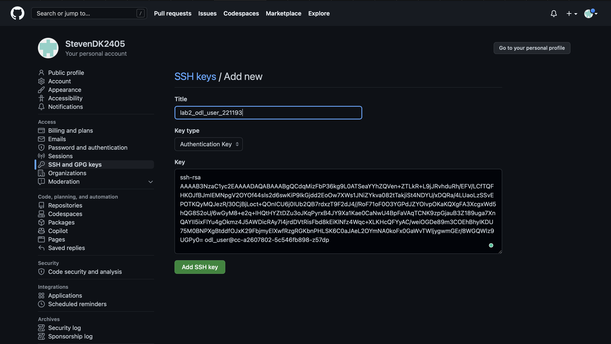
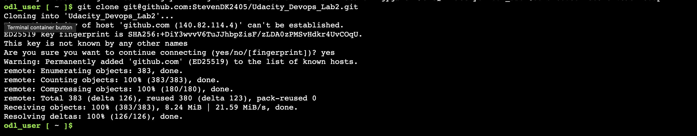
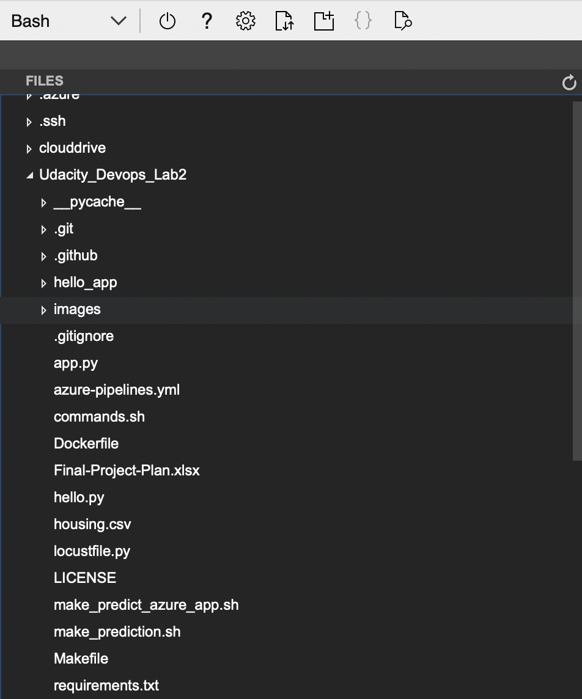
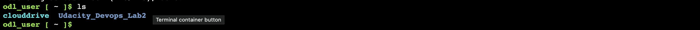
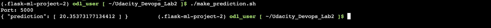
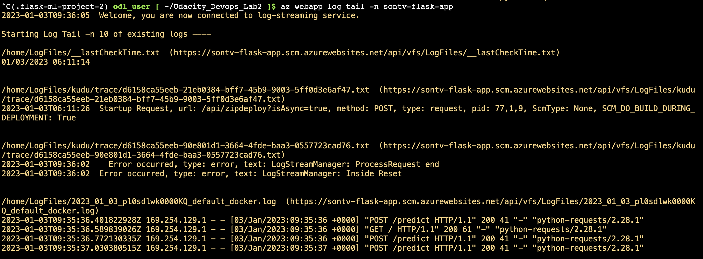

[](https://github.com/StevenDK2405/Udacity_Devops_Lab2/actions)
# Table of Contents

- **[Overview](#Overview)**

- **[Project Plan](#Project-Plan)**

- **[Architecture Diagram](#Architecture-Diagram)**

- **[Configuring Github](#Configuring-Github)**

- **[Instructions](#Instructions)**
  
  - **[Configuring Github](#Configuring-Github)**

  - **[Project Locally](#Project-Locally)**
  
  - **[Project Azure App Service](#Project-Azure-App-Service)**

    - **[ML Azure App Service](#ML-Azure-App-Service)**
  
  - **[Github Actions](#Github-Actions)**
  
  - **[Azure DevOps](#Azure-DevOps)**
  
    - **[Set Up Azure Pipelines for Continuous Delivery](#Set-Up-Azure-Pipelines-for-Continuous-Delivery)**

    - **[Azure Pipeline App](#Azure-Pipeline-App)**

    - **[Clean up resources](#Clean-up-resources)**

- **[Enhancements](#Enhancements)**

- **[Demo](#Demo)**

## Overview

In this project, We will build a Github repository from scratch and create a scaffolding in performing both Continuous Integration and Continuous Delivery.
- Using Github Actions along with a Makefile, requirements.txt and application code to perform an initial lint, test, and install cycle.
- Integrating this project with Azure Pipelines to enable Continuous Delivery to Azure App Service.
- Using Azure Cloud shell in this project.

## Project Plan

- [Trello Board](https://trello.com/b/kwjsc7fU/udacity)
- [Final Project Plan](Final-Project-Plan.xlsx)

## Architecture Diagram

[Architectural Diagram](images/architecture.png)

## Instructions
### Configuring Github

- Log into Azure Cloud Shell

- Create a ssh key

    ```bash
    ssh-keygen -t rsa
    ```
  
  
- Copy the public key to your Github Account -> Settings ->  SSH and GPG keys (https://github.com/settings/keys)
  

- Once your public key is in Github, we can clone the source code to Azure Cloud Shell
 ```
 git clone git@github.com:StevenDK2405/Udacity_Devops_Lab2.git
 ```
  
### Project Locally

- Clone the project (In this project we used Azure Cloud Shell)

 
 

- Create a Python Virtual Environment to run your application

  ```bash
    python3 -m venv ~/.flask-ml-project-2
    source ~/.flask-ml-project-2/bin/activate
  ```

 - Install dependencies
   ```bash
    make all
    ```
  
  

- Run application
    ```bash
    export FLASK_APP=app.py
    flask run
    ```

- Above step would launch a Python Virtual Environment and would run the application. Launch a new Azure Cloud shell session and test the application by running the make_prediction.sh script

    ```bash
    ./make_predictiton.sh
    ```
    

- ```CTRL-C``` to stop the Flask application

- To deactivate the virtual environment run ```deactivate```

### Azure App Service

Azure App Service is a PASS solution provided by Azure which enables to quickly deploy web apps, mobile back-ends and RESTful API's without managing the infrastructure. Below are some of the advantages

- Support multiple languages(Java, C# ...) and frameworks(.NET, Spring boot ...)

- High Availability and Scalability

- Supports both Windows and Linux OS

- Very good integration with Azure pipelines for Continuous Delivery

For more information and Tutorials please refer
[Azure App Service](https://docs.microsoft.com/en-us/azure/app-service/)

#### ML Azure App Service

Azure App service offers multiple ways to create a new application. In this section we will be using the Azure CLI to deploy our app. In the another section we will show how to use the Azure Pipelines to deploy our application.

**Deploy Application:**

- Clone the project (In this project we used Azure Cloud Shell)

- Create a Python Virtual Environment to run your application

    ```bash
        python3 -m venv ~/.flask-ml-project-2
        source ~/.flask-ml-project-2/bin/activate
    ```

 - Install dependencies
   ```bash
    make all
    ```
    
    
- Deploy application into the our resource group

    ```bash
    az webapp up -n sontv-flask-app -g ODL-clouddevops-221113
    ```

- Our application will be deployed and available at
  **(https://${app-name}azurewebsites.net)** default port is 443

  
  
 - Azure app service from the Azure portal
  
  
  - Web application was deployed successfully using azure pipelines from Deployment Center
  

**Test Application:**

- Edit the ```make_predict_azure_app.sh``` with the correct host name of the application to match the deployed prediction


- Run the script to test the app

    ```bash
        ./make_predict_azure_app.sh
    ```

  

- Run the script to load test with locust

    ```bash
        locust
    ```
  

  - The application running with a load test with locust

  

**Logs of Azure Webapp:**

Azure App service provides ability to view the application logs. Application logs was be accessed using Azure CLI commands
    ```
    az webapp log tail -n sontv-flask-app
    ```



### Github Actions

Github actions is a feature of Github to do a complete CI/CD workflow. In this project we use Github actions to do our Continuous Integration workflow. We build, lint and test the code using Github actions.

- In your Git Repository, go to Actions Tab -> New Workflow -> Python Application Workflow ***Git hub can analyze your code and bring relevant workflow for your code***


- Continue with the process, and Github Actions workflow will be setup for our code

- We will have to customize the actions for our needs. The default action steps will run the python commands, since we are using *Make* to 
build, test and lint our code we will modify the Github actions code.

- Edit the .github/workflows/main.yml

    ```yml
    name: Python application test with Github Actions

    on: [push]

    jobs:
      build:

    runs-on: ubuntu-latest

    steps:
    - uses: actions/checkout@v2
    - name: Set up Python 3.8
      uses: actions/setup-python@v1
      with:
        python-version: 3.8
    - name: Install dependencies
      run: |
        make install
    - name: Lint with pylint
      run: |
        make lint
    - name: Test with pytest
      run: |
        make test
    ```

- Run the Action Manually. Once successfully launched you will see the result below


- Once the workflow is setup we will be able to Continuously build our application for every push or pull request on our main branch

### Azure DevOps

Azure DevOps provides developer services for allowing teams to plan work, collaborate on code development, and build and deploy applications. Azure DevOps supports a collaborative culture and set of processes that bring together developers, project managers, and contributors to develop software. It allows organizations to create and improve products at a faster pace than they can with traditional software development approaches.

- Azure Repos provides Git repositories or Team Foundation Version Control (TFVC) for source control of your code.

- Azure Pipelines provides build and release services to support continuous integration and delivery of your applications. 

- Azure Boards delivers a suite of Agile tools to support planning and tracking work, code defects, and issues using Kanban and Scrum methods.

- Azure Test Plans provides several tools to test your apps, including manual/exploratory testing and continuous testing.

- Azure Artifacts allows teams to share packages such as Maven, npm, NuGet, and more from public and private sources and integrate package sharing into your pipelines. 

#### Set Up Azure Pipelines for Continuous Delivery

In this project we use Azure Pipelines for Continuous Delivery of Flask ML App.

- Navigate to [dev.azure.com](https://dev.azure.com) and sign in. You might have to create a Free Account if you don't have a Azure DevOps account

- Create an Azure DevOps project. We'll need to create an Azure DevOps project and connect to Azure. The screenshots below show the steps

- Create an Azure DevOps project and connect to Azure

  

- Once the project is created, from the new project page, select Project settings from the left navigation. On the Project Settings page, select Pipelines > Service connections, then select New service connection


- In the New Service Connections dialog, select Azure Resource Manager from the dropdown.


- In the Service Connection dialogue box
  1. Input a valid value into fields
  
  2. Need to check the box *Grant Access Permissions to all pipelines*\

  3. Save
  
  

#### Azure Pipeline App

- From your project page left navigation, navigate to PipeLines -> New Pipelines

- In the New Pipeline Interface -> Select GitHub as Repo -> Select the Project 

  

  

- In Configure, select *Python to Linux Azure Webapp* -> select the deployed app -> Validate and Review
(In my situation, i choose the option Existing Azure Pipeline YAML file)

- Now that the pipeline is configured, we can Continuously Deliver our ML Flask App, run the pipeline

  

  

  

  

### Clean up resources
To avoid incurring charges on the Azure resources created in this project, delete the resource group that contains the App Service and the App Service Plan.

## Enhancements
- Build effective microservices.
- Build effective alerts that are useful and actionable.

## Demo

[CI/CD Demo Link](https://youtu.be/kapFiDT-_zs)
